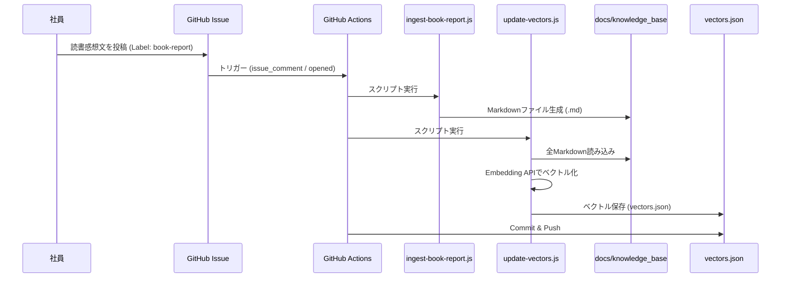
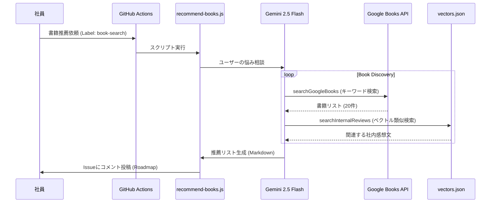

# Saiteki Engineering Training Documentation

新人エンジニア向け研修資料（Frontend/Backend/AWS）のリポジトリです。
VitePressを使用して構築されており、GitHub Pagesで公開されています。

## 🔗 公開URL
**[https://Saitekiinc-com.github.io/saiteki-study-doc/](https://Saitekiinc-com.github.io/saiteki-study-doc/)**

## 🚀 更新・デプロイ方法
このリポジトリの `main` ブランチにプッシュすると、GitHub Actionsが自動的にビルドを行い、公開サイトを更新します。

1.  ファイルを編集・追加する
2.  変更をコミットする
    ```bash
    git add .
    git commit -m "docs: 追記内容の説明"
    ```
3.  GitHubにプッシュする
    ```bash
    git push origin main
    ```
4.  数分後、上記URLに反映されます。

## 💻 ローカルでの開発
手元でプレビューを確認しながら編集する場合の手順です。

### セットアップ
```bash
npm install
```

### 開発サーバー起動
```bash
npm run docs:dev
```
`http://localhost:5173/saiteki-study-react-doc/` にアクセスするとプレビューできます。

## 📂 ディレクトリ構成
*   `docs/`: ドキュメントのソースファイル
    *   `training/curriculum/`: カリキュラム（Lv.1〜Lv.4）
    *   `training/management/`: マネジメント関連（進捗管理、GitHub運用ガイド）
*   `.github/workflows/`: 自動デプロイの設定ファイル
*   `.github/ISSUE_TEMPLATE/`: Issueテンプレート

## 🏗 システムアーキテクチャ & シーケンス

本リポジトリには、GitHub Issuesを活用した「書籍推薦」および「読書感想文ナレッジ化」の自動化フローが組み込まれています。

### 1. 読書感想文のナレッジ化フロー
社員がIssueで読書感想文を投稿すると、自動的にナレッジベース（Markdown）として保存され、さらにベクトル化されて検索可能になります。



### 2. 書籍推薦 & 逆引き検索フロー
社員が「こういうスキルを身につけたい」とIssueで相談すると、AIが「市場の名著」と「社内の感想文」の両方から最適な本を提案します。



## 💰 料金予測 (Cost Prediction)

本システムで使用しているAPIと、想定されるランニングコストの目安です。

| 項目 | 使用モデル/API | 単価 (目安) | 想定月額コスト (月100回利用時) |
| :--- | :--- | :--- | :--- |
| **テキスト生成** | Gemini 2.5 Flash | 入力: $0.10/1M token<br>出力: $0.40/1M token | **約 $0.05 (約7円)**<br><small>※1回あたり約5,000トークン想定</small> |
| **ベクトル化** | Embedding-001 | $0.000000X (ほぼ無料) | **$0.01未満**<br><small>※感想文の蓄積量に依存するが極めて安価</small> |
| **書籍検索** | Google Books API | **無料** (Public) | **$0** |
| **実行環境** | GitHub Actions | 無料枠内 (Public Repos) | **$0** |

**合計予測**: 月間 **$0.1 (約15円) 以下** で運用可能です。
※Gemini APIの無料枠（Rate Limitあり）を利用すれば、コストは完全無料（$0）になります。

